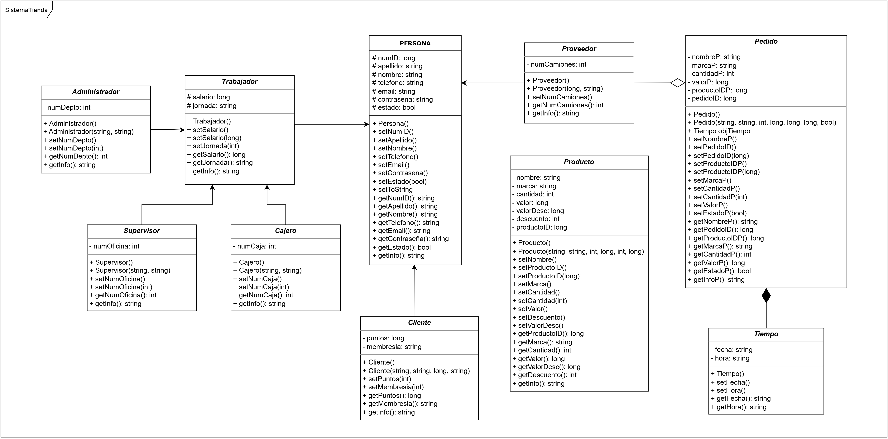
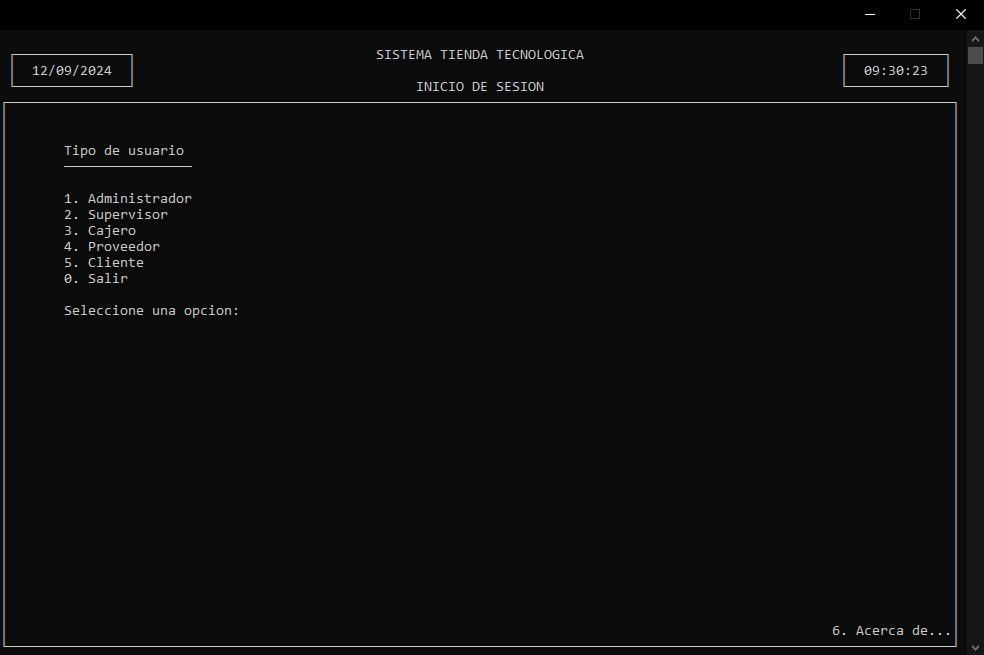
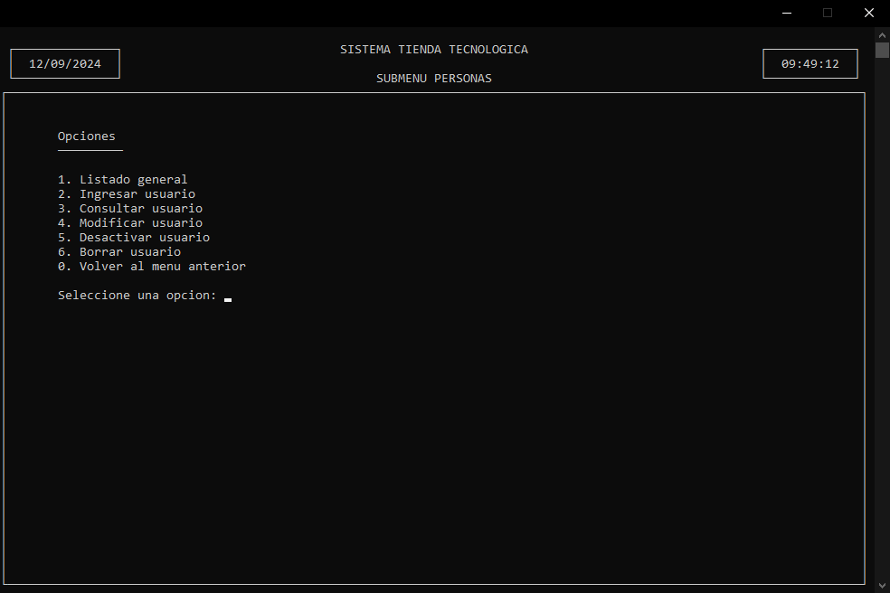
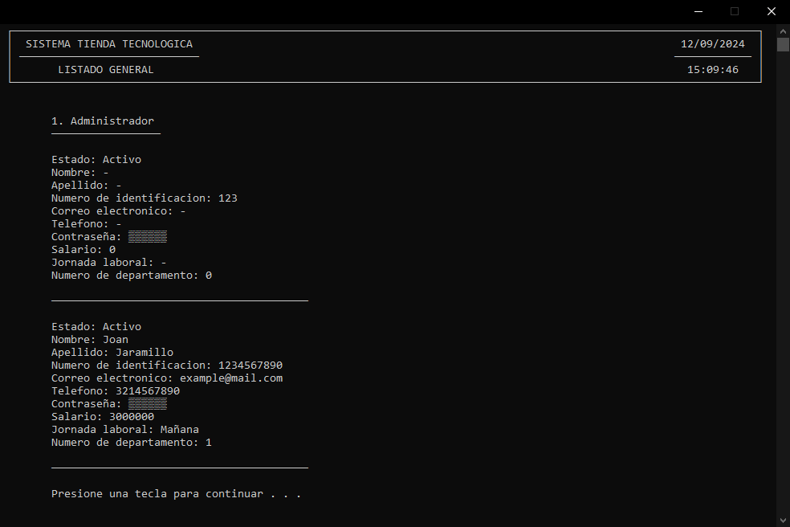
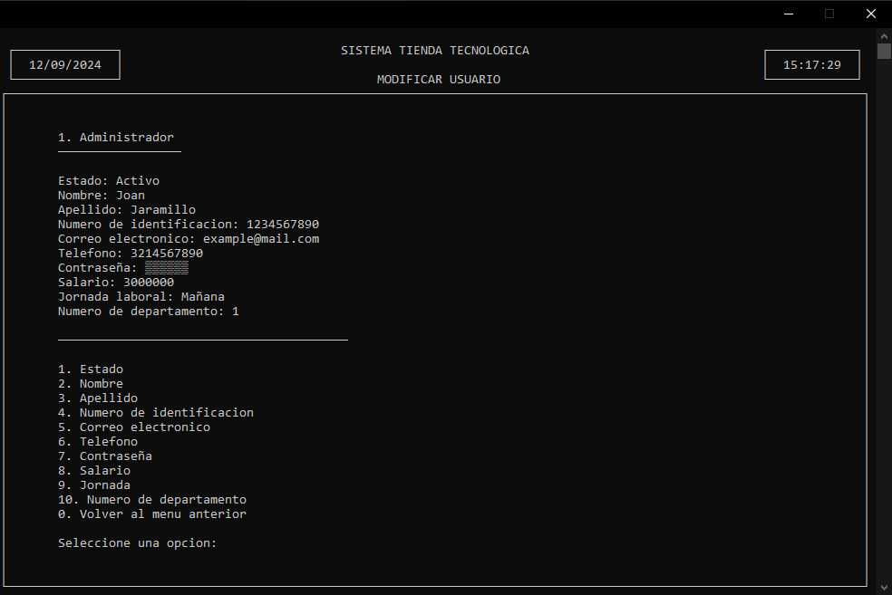

# Tienda Electrónica - Proyecto en C++

---

Este es un proyecto desarrollado como parte de la materia de **Introducción a la Programación Orientada a Objetos** en el segundo semestre de **Ingeniería de Sistemas en la Universidad del Valle**. El objetivo principal de este proyecto es implementar una tienda electrónica donde se gestionan inventarios, ventas, usuarios y pedidos, utilizando el lenguaje de programación **C++** en el IDE CodeBlocks y aplicando los conceptos de **Programación orientada a objetos** como clases, herencia, y polimorfismo, y es una muestra de las capacidades del lenguaje C++.

## Descripción

El sistema de tienda electrónica permite realizar operaciones básicas como la gestión de productos, la creación y modificación de usuarios, la realización de ventas y pedidos, entre otras funcionalidades. Este proyecto es una simulación que podría desarrollarse más a fondo para ser usado en un entorno comercial real.

## Funcionalidades

- **Gestión de usuarios:** Creación, consulta, edición, desactivación y eliminación de usuarios (Administrador, Supervisor, Cajero, Proveedor, Cliente).
- **Gestión de inventario:** Creación, consulta, edición y eliminación de productos en el inventario.
- **Sistema de Ventas**: Registro de ventas, aplicación de descuentos y acumulación de puntos para clientes.
- **Pedidos:** Creación y gestión de pedidos realizados a los proveedores.
- **Cierre de caja:** Funcionalidad para registrar y consultar cierres de caja.

## Requerimientos

### Funcionales

1. Crear, editar y eliminar usuarios (Administrador, Supervisor, Cajero, Proveedor, Cliente).
2. Gestionar productos en el inventario.
3. Realizar ventas y aplicar descuentos.
4. Crear y gestionar pedidos de productos.
5. Consultar y registrar cierres de caja.

### No Funcionales

- **Plataforma:** Windows 7 o superior.
- **Hardware:** Procesador de 1GHz, 1GB de RAM, 2GB de espacio en disco duro.
- **Interfaz:** Menú principal e interfaces personalizadas para cada usuario.
- **Eficiencia:** Respuesta en menos de 5 segundos por funcionalidad.
- **Seguridad:** Borrado seguro de objetos.
- **Usabilidad:** Sistema intuitivo con un tiempo de aprendizaje menor a 2 horas.
- **Seguridad:** Método de borrado que desactiva objetos en lugar de eliminarlos.

## Diagrama de Clases

El siguiente diagrama de clases resume la estructura de clases utilizada en el proyecto:

## Capturas de Pantalla

### Menú Principal

### Submenú Personas

### Listado General

### Menú Modifación

